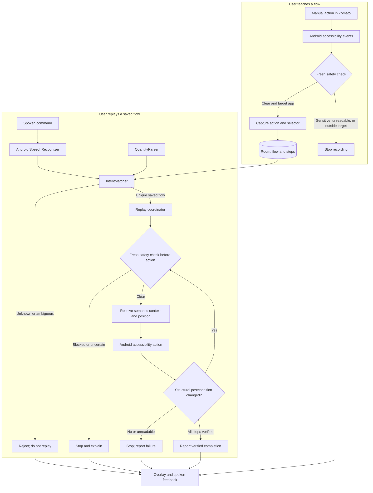

# Voice Macro Studio

Voice Macro Studio is an Android accessibility app for teaching a simple app interaction once and replaying it with a spoken command. This hackathon build focuses on one learned, single-tap food item in Zomato, with verified quantity replay from 1 to 5. Commands are matched locally against flows the user has taught; the app does not invent new workflows or place orders.

## Team STRAWHATS

- Soumya Ranjan Sahoo
- Sandesh Anand
- G Vivek
- Ankit Kumar Yadav

## Hackathon Submission

- **Source repository:** [ANKIEMUNKIE/voice_macro_Studio](https://github.com/ANKIEMUNKIE/voice_macro_Studio)
- **Demo video:** [Watch the demonstration](https://youtu.be/HedNCph6ZhA)
- **Installable APK:** [Download v0.4.0 quantity demo](https://github.com/ANKIEMUNKIE/voice_macro_Studio/raw/refs/heads/main/dist/VoiceMacroStudio-v0.4.0-quantity-debug.apk)
- **Required Git tag:** [`PRISM_GENAI_HACKATHON_Y2026`](https://github.com/ANKIEMUNKIE/voice_macro_Studio/tree/PRISM_GENAI_HACKATHON_Y2026)
- **Presentation:** [Voice Macro Studio — STRAWHATS (.pptx)](docs/Voice-Macro-Studio-STRAWHATS.pptx)
- **AI disclosure:** [Development tools and runtime AI disclosure](AI_DISCLOSURE.md)
- **Runtime requirements note:** [`requirements.txt`](requirements.txt) explains why the Android project has no Python package requirements.

The APK is debug-signed for evaluation and is not a production Play Store release. Its SHA-256 is `22B67F650F26DE9C9C74A7F5F321A77246C58261DEACD3397A2B4AE0C3327566` (also recorded in [`dist/SHA256SUMS.txt`](dist/SHA256SUMS.txt)).

## What It Does

1. The user opens a supported target app and starts teaching from Voice Macro Studio's accessibility overlay.
2. The user speaks a name for the flow and demonstrates the interaction manually.
3. Voice Macro Studio records supported accessibility click/text-change events as selector-based steps and saves the learned flow locally.
4. Later, the user says the learned flow name, optionally with a supported quantity. The app matches the speech-recognition alternatives to a saved flow for the active app.
5. Before each replay action, the app rechecks the active screen. It resolves the recorded target, performs one accessibility action, and verifies that the nearby UI structure changed before continuing.
6. The app reports completion, a blocked action, or a failure in its overlay and spoken status.

The supported demo is a learned Zomato menu item whose original action is one **ADD** tap. Start with that item absent from the cart. A request for a total quantity of 1-5 is performed through the learned ADD action and the observed quantity control. If the item is already in the cart, the app refuses to guess whether the request means "add more" or "set total."

## Supported Scope

| Area | Current build |
| --- | --- |
| Android app | Kotlin, Android accessibility service, native app UI |
| Target app | Zomato for the validated quantity demo |
| Additional declared target | Swiggy is detected, but replay is unsupported on the tested device because its accessibility tree is unreadable to the service; the app blocks instead of bypassing safety |
| Teaching | Explicitly started, user-demonstrated click and text-change events; learned flows are stored locally |
| Command matching | Deterministic local matching against flows saved for the active target app; unknown or ambiguous matches do not start replay |
| Speech | Android `SpeechRecognizer` and Android text-to-speech services; availability and recognition quality depend on the device and installed speech services |
| Quantity | 1-5 for a learned single-tap Zomato item; digits, English number words, and selected Hindi/Hinglish words are parsed locally |
| Safety | Fresh screen checks; login, password, OTP, payment, unreadable, outside-target, and manual-stop states block automation |
| Persistence | Room database in the app's private storage; learned flows are not shared between devices |

## Architecture

The app is a single Android application module. `MacroAccessibilityService` coordinates teaching, speech input, flow matching, safety checks, replay, the floating overlay, and spoken feedback. Smaller packages isolate snapshots, database entities/access, matching, quantity parsing, selector scoring, and safety policy.



The runtime pipeline is deliberately bounded: speech recognition proposes alternatives; deterministic code matches a saved flow and parses an optional quantity; the service checks the current screen; a semantic-and-spatial selector resolves the demonstrated control; Android performs one accessibility action; and a structural postcondition must confirm a changed UI state before the next action or a completion message.

## Tech Stack

| Layer | Technology | Role |
| --- | --- | --- |
| Language and application | Kotlin 2.0.21, Android SDK 36, minimum SDK 26 | Native Android app and accessibility-service implementation |
| Automation surface | Android `AccessibilityService` | Observe supported UI events, resolve controls, and dispatch bounded actions |
| Voice and feedback | Android `SpeechRecognizer`, Android text-to-speech | Capture command alternatives and speak status without a paid API |
| Local persistence | Room 2.7.2 | Store learned flows and ordered steps in private app storage |
| Matching and safety | Deterministic Kotlin components | Flow matching, quantity parsing, selector scoring, sensitive-screen policy, and postcondition checks |
| Build toolchain | Gradle 8.13, Android Gradle Plugin 8.11.1, Java 17 | Reproducible builds, unit tests, lint, and APK assembly |
| Tests | JUnit, Robolectric, MockK | JVM coverage for capture, intent, replay selection, quantities, and safety policy |

No API key, paid LLM, cloud database, or target-app SDK is required. The runtime does not call a generative-AI service.

### Main Components

| Component | Implementation |
| --- | --- |
| Accessibility coordinator | [`MacroAccessibilityService.kt`](app/src/main/java/dev/voicemacro/studio/MacroAccessibilityService.kt): filters target-app events, runs safety checks, records steps, handles speech, coordinates replay, and presents the overlay |
| Screen capture | [`SnapshotBuilder.kt`](app/src/main/java/dev/voicemacro/studio/capture/SnapshotBuilder.kt) and `UiSnapshot.kt`: collect accessibility nodes and build structural screen signatures |
| Safety | [`SafetyPolicy.kt`](app/src/main/java/dev/voicemacro/studio/safety/SafetyPolicy.kt) and `SensitiveScreenReader.kt`: classify sensitive labels/password fields and fail closed when the screen cannot be read |
| Intent and quantity | [`IntentMatcher.kt`](app/src/main/java/dev/voicemacro/studio/intent/IntentMatcher.kt) and [`QuantityParser.kt`](app/src/main/java/dev/voicemacro/studio/intent/QuantityParser.kt): match against saved flow names and parse the supported quantity vocabulary locally |
| Selector resolution | [`SelectorTextMatcher.kt`](app/src/main/java/dev/voicemacro/studio/replay/SelectorTextMatcher.kt) and [`SpatialSelector.kt`](app/src/main/java/dev/voicemacro/studio/replay/SpatialSelector.kt): combine selector text/context and recorded screen position, rejecting unsafe ambiguity |
| Local persistence | [`MacroEntities.kt`](app/src/main/java/dev/voicemacro/studio/db/MacroEntities.kt), `MacroDao.kt`, and `MacroDatabase.kt`: persist flows, ordered steps, and related local data with Room |
| App setup UI | [`MainActivity.kt`](app/src/main/java/dev/voicemacro/studio/MainActivity.kt): accessibility setup, microphone permission, spoken-feedback test, and deletion of learned flows |

### Safety and Data Handling

- The accessibility service is not enabled automatically. The user must enable it in Android Settings.
- Safety inspection is transient. Raw screen trees and screen labels are not written to diagnostic logs.
- A confirmed sensitive screen or an unreadable/unknown screen cannot authorize an action. A manual Stop also blocks replay until the user performs a fresh clear-screen recheck.
- Every dispatched replay action requires a fresh safety check. A successful accessibility dispatch alone is not considered success; the app waits for a bounded structural postcondition.
- During an explicitly started teaching session, selectors and text values needed to reproduce the demonstrated flow are stored in the app's private Room database. Do not teach with credentials, OTPs, payment data, or other sensitive personal information.
- Learned flows and history are local to the device. **Delete all learned flows** in the app removes learned flows and replay history.
- The runtime does not call a generative-AI service. Speech recognition and text-to-speech use Android platform services; flow matching and quantity parsing are deterministic local code. GitHub Copilot was used as a development and documentation assistant.

The complete disclosure, including OpenAI Codex assistance and human-review responsibilities, is in [`AI_DISCLOSURE.md`](AI_DISCLOSURE.md).

## Requirements

- Android Studio with Android SDK Platform 36
- Java 17 for Gradle
- Android device or emulator running Android 8.0/API 26 or newer
- Zomato installed and logged in by the device owner for the demonstrated flow
- Microphone access and an Android speech-recognition service
- Internet access may be needed for Gradle dependencies and the device's speech-recognition service

The project uses Android Gradle Plugin 8.11.1, Gradle 8.13, Kotlin 2.0.21, minimum SDK 26, and compile/target SDK 36. No API key, paid AI service, or billing account is required.

## Install the APK

Download the [debug APK](https://github.com/ANKIEMUNKIE/voice_macro_Studio/raw/refs/heads/main/dist/VoiceMacroStudio-v0.4.0-quantity-debug.apk), then install it with Android Debug Bridge:

```powershell
adb devices
adb install -r ".\VoiceMacroStudio-v0.4.0-quantity-debug.apk"
```

If installing from a project checkout, use the APK at `dist/VoiceMacroStudio-v0.4.0-quantity-debug.apk` instead.

## Build and Test

Clone the repository:

```powershell
git clone https://github.com/ANKIEMUNKIE/voice_macro_Studio.git
cd voice_macro_Studio
```

Open the folder in Android Studio and set **Gradle JDK** to Java 17. Or run the project checks on Windows, after setting `JAVA_HOME` to a JDK 17 installation:

```powershell
$env:JAVA_HOME = "C:\path\to\jdk-17"
./gradlew.bat testDebugUnitTest assembleDebug lintDebug --console=plain
```

The repository's v0.4.0 validation completed with 30 JVM tests passing; debug APK assembly and lint also completed. Lint reported warnings, so this is not a warning-free build. The generated APK is placed under the Gradle user home by default:

```text
%USERPROFILE%\.gradle\voice-macro-studio\build\app\outputs\apk\debug\app-debug.apk
```

`local.properties` is machine-specific and should not be committed. Generated build outputs are directed outside the OneDrive checkout.

## How to Use the App

### One-Time Setup

1. Install and open Voice Macro Studio. Grant microphone permission when requested.
2. Tap **Open accessibility settings**. Find Voice Macro Studio under installed/downloaded accessibility services and enable it. Android requires the user to do this manually.
3. Return to Voice Macro Studio and check that accessibility is connected. Use **Test spoken feedback** to confirm that text-to-speech is available.
4. Open Zomato and sign in manually if needed. Never automate or record login, password, OTP, or payment entry.

### Teach a Flow

1. In Zomato, open a restaurant menu and bring the chosen item and its **ADD** control into view. Choose an item that adds with one tap and does not require customization.
2. Make sure the item is completely absent from the cart. The demo flow expects the original **ADD** state.
3. Confirm the Voice Macro Studio accessibility overlay is blue/clear. Use **Recheck** if needed; if the screen is orange or unreadable, stop and navigate manually to a safe screen.
4. Tap **Record** and say a distinctive flow name, for example: "choco chip brownie safe."
5. Wait for the recording state, then manually tap the chosen item's **ADD** control exactly once.
6. Tap **Record** again to stop and save. Confirm the overlay reports a saved step.
7. Remove the item from the cart and return to the same menu and scroll position before replaying.

### Replay a Flow

1. Return to the menu where the flow was taught. Confirm the item is absent and the overlay is clear.
2. Tap **Listen** and speak the saved flow name. For quantity one, say the flow name, such as "choco chip brownie safe."
3. For a quantity from 2 to 5, include it in the command, for example: "Add three choco chip brownie safe."
4. Wait for the overlay's result. A successful run reports **Replay completed and verified** and the requested quantity.
5. To stop automation, tap **Stop Safety**. Replay remains blocked until the user navigates to a clear screen and uses **Recheck**.

Example checks:

- From an empty item state, "Add three choco chip brownie safe" should finish at quantity 3.
- "Do choco chip brownie safe" is the live-tested Hinglish example for quantity 2.
- If quantity 2 is already present, requesting quantity 3 must be refused without changing the cart. Remove the item fully before a new quantity run.
- "Add six choco chip brownie safe" is outside the supported range and must be rejected.
- Never confirm an order. Payment is a user-only handoff and automation is blocked there.

## Validation and Limitations

Validated on Android 16 with Zomato: correct-item exact replay, a wrapper paraphrase, English quantity 3, Hinglish quantity 2, verified UI transitions, unknown-command rejection, manual Stop, existing-cart rejection, unsupported-quantity rejection, and payment-screen blocking. The v0.4.0 debug APK is installable and its checksum is recorded above.

This is a bounded hackathon demo, not a general-purpose automation product:

- Quantity 1-5 applies only to a learned single-tap Zomato item and requires the item to start absent from the cart.
- Choosing a different item without teaching it, selecting a saved address, and completing a purchase are not supported.
- Swiggy replay is unsupported on the tested device because Swiggy did not expose a usable accessibility tree. The app blocks rather than using coordinate taps or a safety bypass.
- Speech availability and recognition accuracy depend on Android services, device configuration, language packs, and network conditions.
- The full original T1-T14 test matrix and a large statistical paraphrase sample were not completed. Results above describe specific tested scenarios, not a general reliability guarantee.
- Debug signing is for evaluation only; this APK is not suitable for Play Store distribution.

## Project Structure

```text
app/src/main/java/dev/voicemacro/studio/
  capture/   Accessibility snapshots and UI node models
  db/        Room entities, database, and DAO
  intent/    Local flow matching and quantity parsing
  replay/    Selector text and spatial matching
  safety/    Sensitive-screen classification and safety gate
  MainActivity.kt
  MacroAccessibilityService.kt
app/src/test/  JVM tests for capture, intent, replay, and safety
dist/          Checksum and evaluation APK
docs/          Hackathon presentation
gradle/        Gradle wrapper configuration
```

## Submission Checklist

- [x] Source code
- [x] Presentation
- [x] Demo video link
- [x] AI disclosure
- [x] Detailed README
- [x] Evaluation APK and SHA-256 checksum
- [x] Git tag `PRISM_GENAI_HACKATHON_Y2026`
- [x] Runtime requirements note

The repository tag identifies the complete submitted baseline, including the presentation and disclosure.
